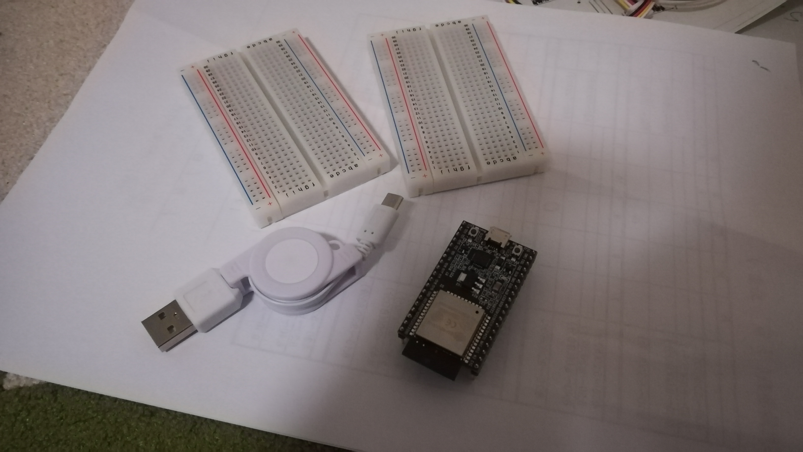
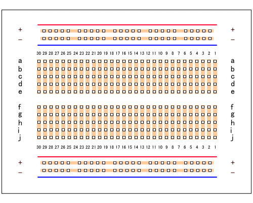
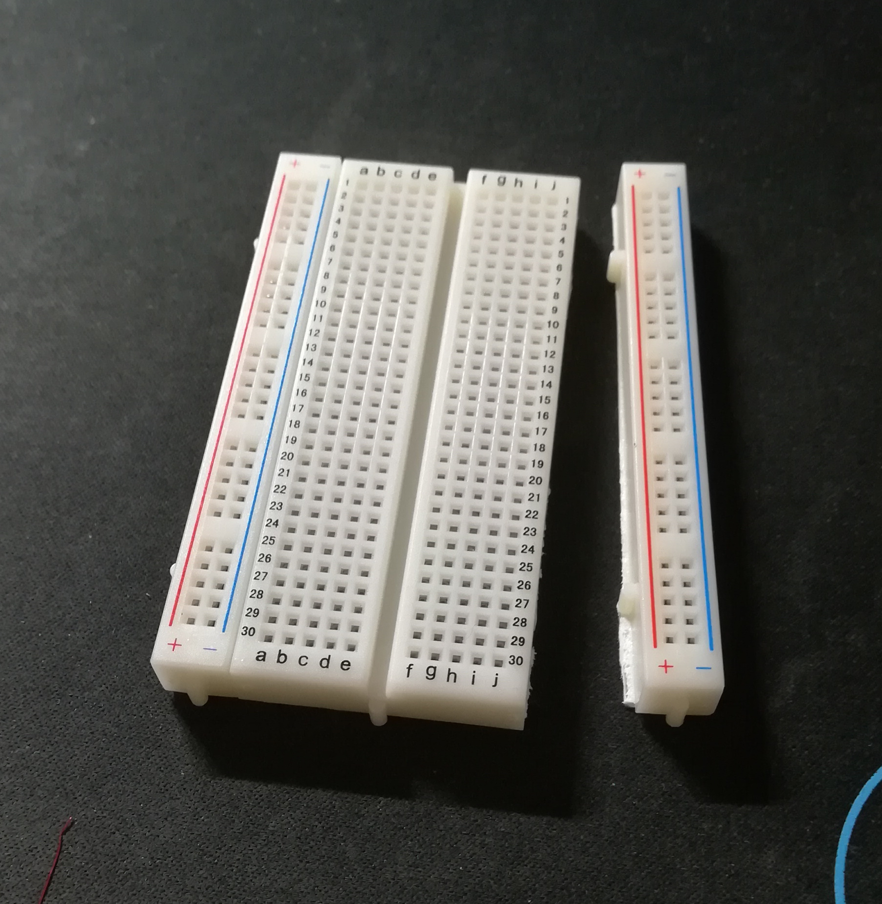
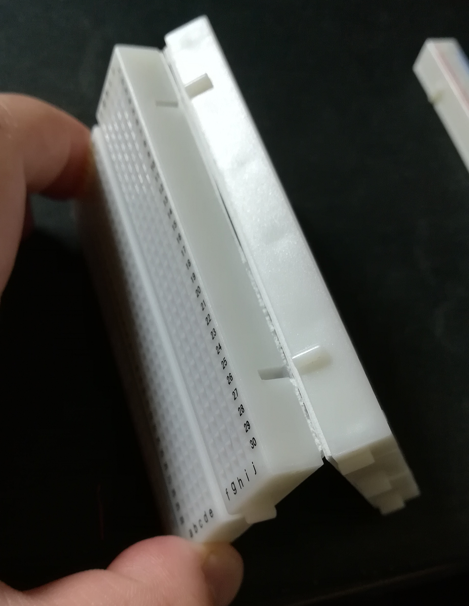
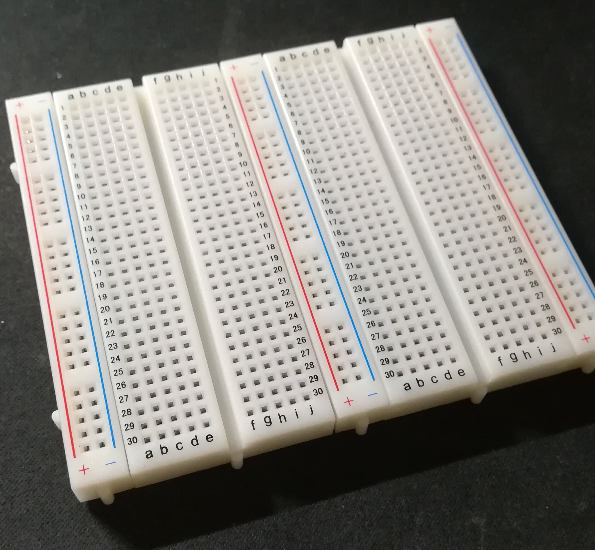
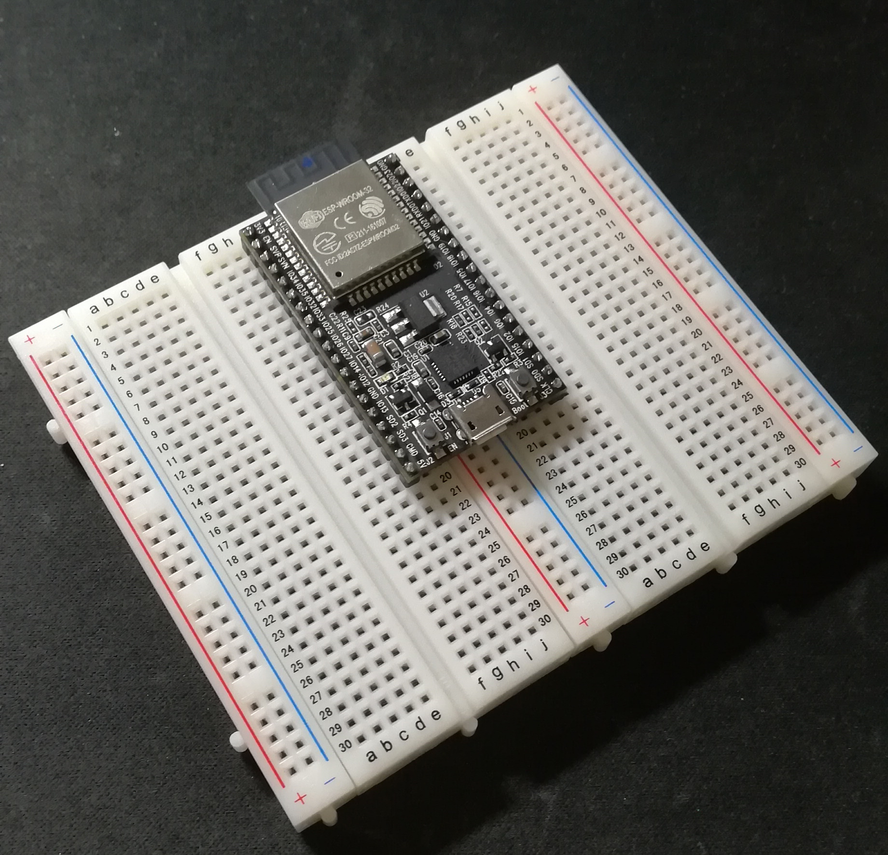

# 0.ESP32の組み立て

色々と開発を始める前に、ESP32のいろいろな組み立てをする。

### 使うもの
- ブレッドボード 2枚
- ESP32
- カッターナイフ

### ブレッドボードについて

ブレッドボードは電子工作をする際に手軽に回路を設計できる板です。

ブレッドボードの内部は以下のように電気が通るようになっています。

つまり、1 ~ 30 列には、1列に電気が通り +, - の行には横方向に電気が通る。

そのため、ブレッドボード上にパーツを配置するときは、これを考えて配置していきます。

## ブレッドボード上にESP32をつける

今回使用するESP32は高機能故にサイズが少し大きいという弱点があります。

ブレッドボードを1枚使用するとそれだけで大部分がESP32に専有されてしまい、パーツをつなげるのに一苦労します。

そのため、今回はブレッドボードを2つつなげ、作業スペースを大きくしていきます。

#### ブレッドボードの粘着テープを切り取る。

どちらか一つのブレッドボードの +, -の部分を切り離します。

切り離し方は

- +,- の部分に印をつける
- 印に沿ってカッターナイフを入れる
- 切り取った粘着テープごと切り離す

切り取ったものはこのようになります

切り終わったら、もう一方の切り取られていない方のブレッドボードとつなげ合わせます。

このように凹凸に合わせて接続してください。

接続し終えた後、きちんと入っていれば1枚のボードのようになり、この上にESP32を置きます。

