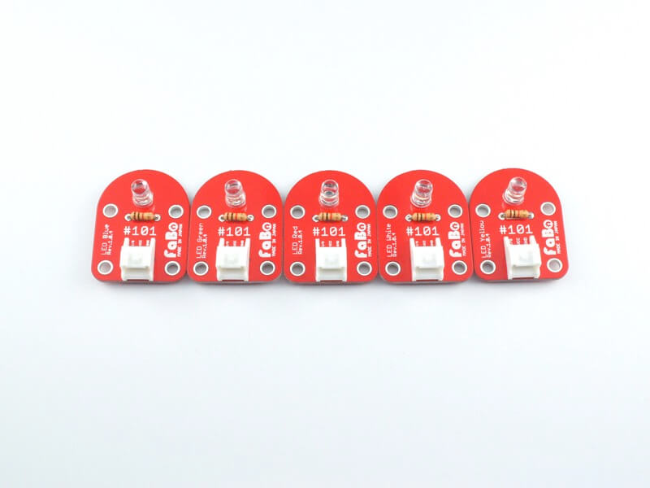
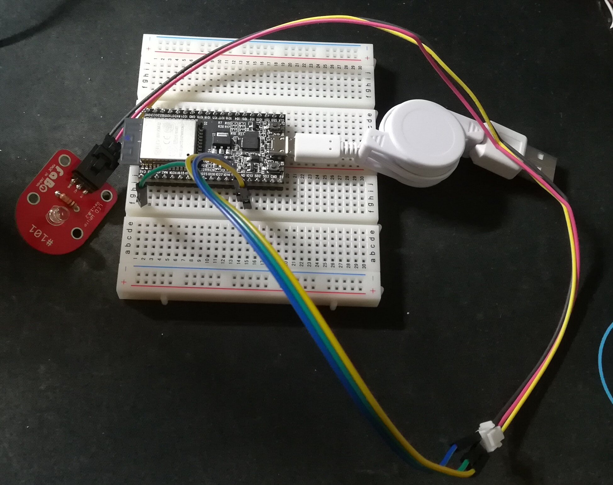
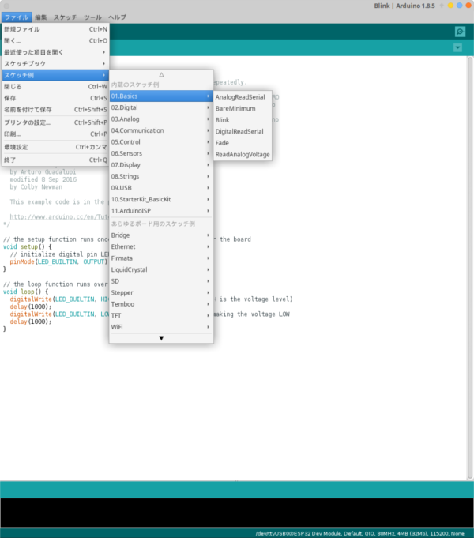

# はじめに

このページで紹介するLEDの点滅は **Lチカ** と呼ばれるハードウェアのHello world的存在です。

## 準備

Fabo starter kit の中に入っている ** #101 ** と書かれた基板を取り出します。



取り出したあと、3つ穴のコネクタを基板に差し込み

- 赤色の線 ... 下の画像の **3V3** と書かれたところにピンを差し込む
- 黒色の線 ... 下の画像の **GND** と書かれたところにピンを差し込む
- 黃色の線 ... 下の画像の **IO13** と書かれたところにピンを差し込む




ここまでくればあとはプログラミングだけ、Arduino IDEを起動する。

> ファイル → スケッチ例 → Blink

を押して、Lチカのサンプルコードを出す。



Lチカのサンプルコードはこのようになっている。

```Blink.ino
// the setup function runs once when you press reset or power the board
void setup() {
  // initialize digital pin LED_BUILTIN as an output.
  pinMode(LED_BUILTIN, OUTPUT);
}

// the loop function runs over and over again forever
void loop() {
  digitalWrite(LED_BUILTIN, HIGH);   // turn the LED on (HIGH is the voltage level)
  delay(1000);                       // wait for a second
  digitalWrite(LED_BUILTIN, LOW);    // turn the LED off by making the voltage LOW
  delay(1000);                       // wait for a second
}
```

これだとArduinoでは動くがESP32だとうまく動かない。

そのため、このコードを少し手直しする。

```Blink_ESP32.ino
#define LEDPIN 13  // 13番ピンにLEDをつなげたため、LEDの出力ピンを13にする

// the setup function runs once when you press reset or power the board
void setup() {
  // initialize digital pin LED_BUILTIN as an output.
  pinMode(LEDPIN, OUTPUT);
}

// the loop function runs over and over again forever
void loop() {
  digitalWrite(LEDPIN, HIGH);   // turn the LED on (HIGH is the voltage level)
  delay(1000);                       // wait for a second
  digitalWrite(LEDPIN, LOW);    // turn the LED off by making the voltage LOW
  delay(1000);                       // wait for a second
}
```

変えたところとしてはマクロとして13番ピンを定義、これでLチカの準備は完了。