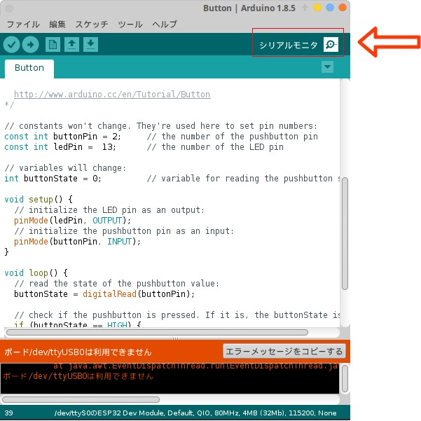
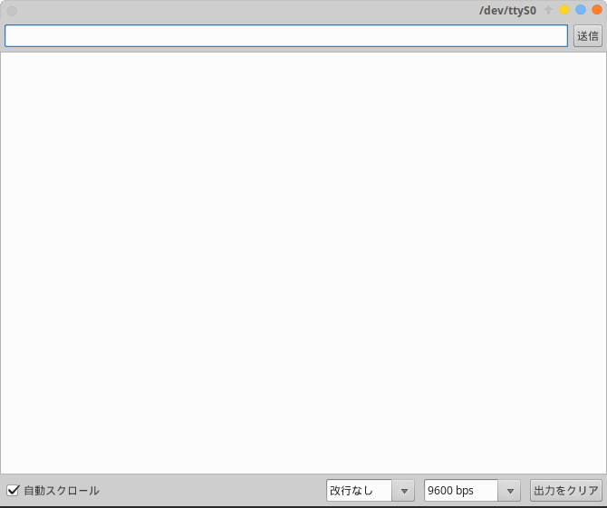
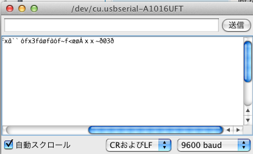

# ESP32でボタンを使う

ボタンが使えるようになると、ボタンが押されたとき~をするなどの動きを作ることができるようになったり、ボタンでモードを選択するなどのプログラムも書けるようになります。

そのためにもまずは数字をカウントアップするプログラムを書いてみましょう。

## 配線
使うものは **#103**のButton Blickです。


これにコネクタをつなげ、

- 赤色の線 ... 下の画像の **3V3** と書かれたところにピンを差し込む
- 黒色の線 ... 下の画像の **GND** と書かれたところにピンを差し込む
- 黃色の線 ... 下の画像の **IO2** と書かれたところにピンを差し込む


2番ピンがボタンの信号を受信する役目をします。

(ここに配線した後の画像を出す)

## コーディング

使用するコードはこのようなものです。

```Button.ino
const int buttonPin = 2;     // the number of the pushbutton pin
int buttonState = 0;         // variable for reading the pushbutton status
int buttonNumber = 0;

void setup() {
  // initialize the pushbutton pin as an input:
  pinMode(buttonPin, INPUT);

  Serial.begin(9600);
}

void loop() {
  // read the state of the pushbutton value:
  buttonState = digitalRead(buttonPin);

  // check if the pushbutton is pressed. If it is, the buttonState is HIGH:
  if (buttonState == HIGH) {

    // buttonNumber increment
    // But, ButtonNumver = 10
    // To change buttonNumber is 0

    if(buttonState == 10){
        buttonNumber = 0;
    } 
    
    else{ 
        buttonNumber++;
    }

    Serial.println(buttonNumber);
  } 

  delay(100);
}
```

コード中にある `Serial` の部分は、シリアル通信をする部分、ESP32などのデバッグはPCにデータを送信することで行われるが、Serialを使うと簡単に知ることができる。

上のコードをESP32に書き込むと、ボタンが使用できるようになる。

シリアルモニタを起動して、ボタンを押して数字が増えていくのを確認しよう。

### シリアルモニタの出し方
シリアルモニタはterminalなどでも呼び出せるが、Arduino IDEからも見ることができる。

Arduino IDEの右上にある虫眼鏡のようなボタンをクリックすると、新しいウィンドウが生成され、シリアルモニタが起動する。




文字化けなどが発生しているときには、右下のbps表示が、プログラム中の `Serial.begin(NUM)` と同じかどうかを確認する。



