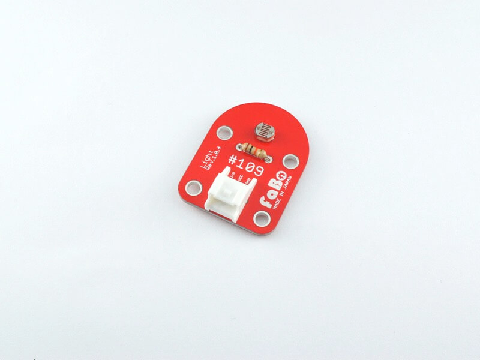
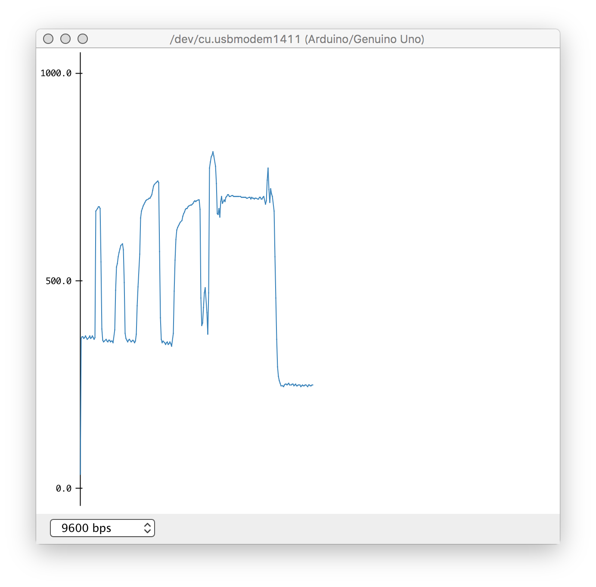

# 照度センサー

今回の農業Iotでも使用する、光量（照度）センサーを使用します。

使うものは **#109** と書かれた基板です。



この基板ではアナログでしか値を取得することができないので、配線には注意してください。

これにコネクタをつなげ、

- 赤色の線 ... 下の画像の **3V3** と書かれたところにピンを差し込む
- 黒色の線 ... 下の画像の **GND** と書かれたところにピンを差し込む
- 黃色の線 ... 下の画像の **A0** と書かれたところにピンを差し込む


(ここに配線の結果を貼る)

プログラムはこちら、アナログなのでanalogReadで値を読み込み、シリアルモニタに出力しています。

```
#define lightPin A0

int lightValue = 0;

void setup() {
  pinMode(lightPin,INPUT);
  Serial.begin(9600);
}

void loop() {
  lightValue = analogRead(lightPin);
  Serial.println(lightValue);
  delay(100);
}
```

これを書き込むと、センサーに入ってくる光の量がシリアルモニタに表示されます。

センサの上に手をかざすなどして光量を調節し、値が大きくなったり小さくなったりすることを確認してみてください。

また、シリアルモニタだけでなく、シリアルプロッタを用いると、視覚的に光の量を知ることができます。

