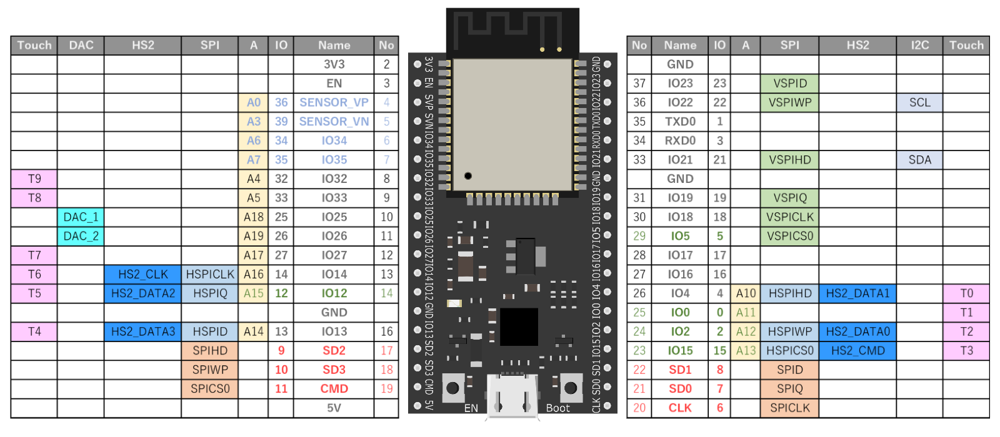

# 温湿度センサを使う

温湿度センサを使うと室温がはかることができ、これをサーバーにアップロードすればデータとして見ることができる。

今回の農業Iotのセンサーにも含まれているDHT11を使用して、この部屋の温度と湿度を測ってみましょう。

## 使用するセンサ

使用するセンサーは **#115** と書かれたセンサです。


この基板ではアナログでしか値を取得することができないので、配線には注意してください。

これにコネクタをつなげ、

- 赤色の線 ... 下の画像の **3V3** と書かれたところにピンを差し込む
- 黒色の線 ... 下の画像の **GND** と書かれたところにピンを差し込む
- 黃色の線 ... 下の画像の **17** と書かれたところにピンを差し込む




これを使用するためには自分で全てプログラムを書くのでもいいですが、コード量が膨大になりがちなので、今回は第三者が作成したライブラリを使用します。

ライブラリはArduino IDEからダウンロードして使用することができます。

> スケッチ → ライブラリをインクルード → ライブラリを管理

から、ライブラリ管理画面に移ります。


左上の検索バーに **DHT sendor** と入力して、上から二番目にある **DHT sensor library for ESPx** をインストールします。


インストールが終わったら、これを使えるようにプログラムを組みます。

```DHT.ino
#include <DHTesp.h>

DHTesp dht;

TaskHandle_t tempTaskHandle = NULL;

int dhtPin = 17;

void setup() {
  // put your setup code here, to run once:
  Serial.begin(9600);
  dht.setup(dhtPin, DHTesp::DHT11);
}

void loop() {
  // put your main code here, to run repeatedly:
  TempAndHumidity lastValues = dht.getTempAndHumidity();

  Serial.println("Temperature: " + String(lastValues.temperature,0));
  Serial.println("Humidity: " + String(lastValues.humidity,0));

  delay(1000);
}
```

これを書き込むと、現在いる部屋の温度と湿度を知ることができます。

先ほどやったようにシリアルモニタを表示して確認しましょう。

