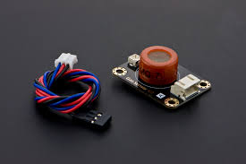
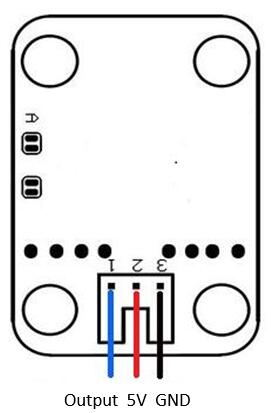

# Co2センサーMQ7

MQ7センサーはアナログ値でCo2濃度を測ることのできるセンサーです。0 ~ 4096までの値を取得することができます。



# 配線
アナログの値を取得するので、アナログの値を取得できるピンに接続します。



配線としては

- 青い線 ... ESP32のアナログピンに接続
- 赤い線 ... ESP32の **5V** に接続
- 黒い線 ... ESP32の **GND** に接続


### サンプルコード

```co2.ino
void setup(){
  Serial.begin(9600); 
}

void loop(){
    int val;
    val=analogRead(4);
    Serial.print("Co2 : ");
    Serial.println(val>>2);
    delay(100);
}
```

動かしてシリアルモニタを見ると、Co2の量がppmで表示される。このセンサーはArduino用に作られているので、そのまま使用すると値が合わない。

これはArduinoのアナログ値の分解能が10bitで、ESP32の分解能が12bitまであるために起きる現象である。

そのため、それを丸めるために右シフトで2bit捨てるか、Arduinoのmap関数を使用することの二通りの解決法がある。

今回は前者を使用し、プリントの部分でシフトをした。