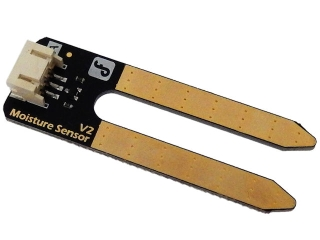

# 土壌湿度センサー

植物を生育させるためには、土壌の水分量も大きな要因です。そのため、土の水分量を知ることのできるセンサーを使えるようにします。



アナログ値でデータが取得できます。同梱されているケーブルを接続し、以下のように配線します。

- 黒色の線 ... ESP32の **GND** に接続する
- 赤色の線 ... ESP32の **5V** に接続する
- 青色の線 ... ESP32の **A10(IO4)** に接続する


アナログで値を取得できるので、アナログピンに接続すれば値を取得できます。

値は `0~1024` までの値を取ることができます。

公式の情報によると
- 0 ~300 : dry soil
- 300~700 : humid soil
- 700~950 : in water

となっています。

```moisture.ino
void setup() {
  // put your setup code here, to run once:
  Serial.begin(9600);
}

void loop() {
  // put your main code here, to run repeatedly:
  int soilhumid = analogRead(A10);
  soilhumid = soilhumid >> 2;
  Serial.print("Moisture of soil :");
  Serial.println(soilhumid);
  delay(1000);
}
```
