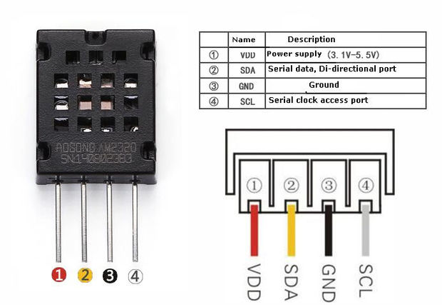

# AM2320

AM2320は、DHT31と同じような形をしていますが、内容は少し違います。

I2Cというプロトコルでデータの通信をしていて、すこし配線が違います。



このようなピン配置になっているので、ESP32のそれぞれのピンにつなげていきます。


ピンがつなげ終わったらプログラムを書きます。

[ここ](https://github.com/EngDial/AM2320)のファイルをzipでダウンロードしてArduino IDEで **ZIPファイルからダウンロード** をクリックしてダウンロードする。

インストールが終わると使用ができるので、このプログラムを書き込む。

```am2320.ino
#include <Wire.h>
#include <AM2320.h>
 
AM2320 th;
 
void setup() {
Serial.begin(9600);
Wire.begin();
}
 
void loop() {
Serial.println("Chip = AM2320");
switch(th.Read()) {
case 2:
Serial.println(" CRC failed");
break;
case 1:
Serial.println(" Sensor offline");
break;
case 0:
Serial.print(" Humidity = ");
Serial.print(th.Humidity);
Serial.println("%");
Serial.print(" Temperature = ");
Serial.print(th.cTemp);
Serial.println("*C");
Serial.println();
break;
}
delay(2000);
}
```

これで室温や湿度を取得できる。