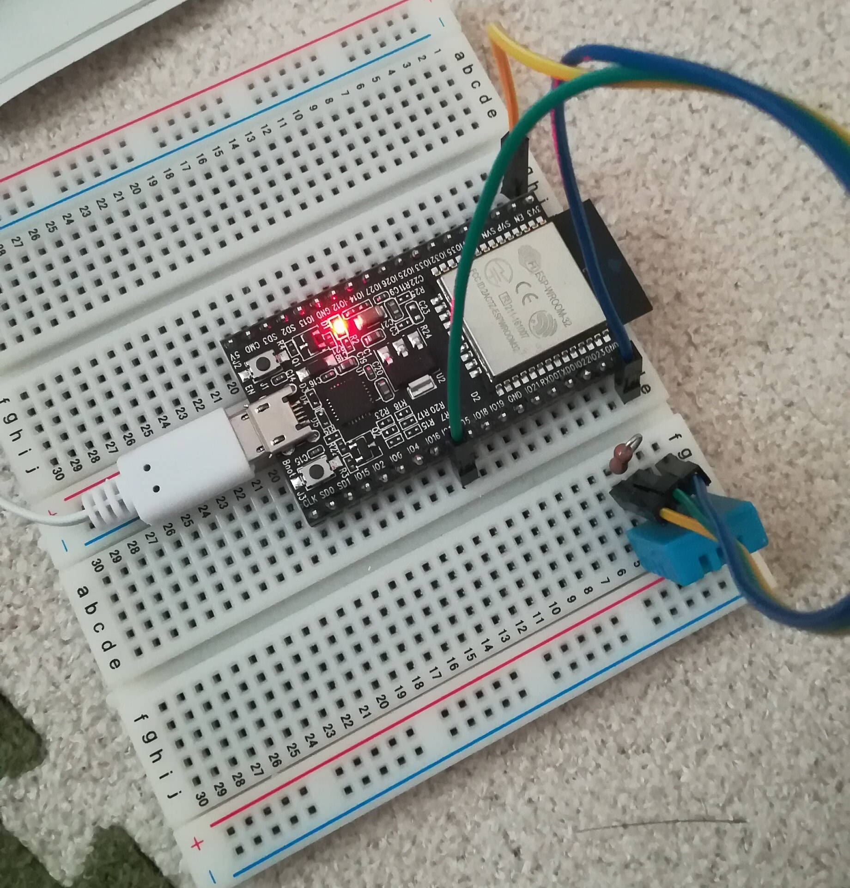

# DHT11

DHT11はHello Worloセクションでも触れましたが、同じものを使用します。

ここで使うセンサは単体なので、実際に使用する際には配線が必要になります。

画像のように見ると、VDD, DATA, GNDのピンがあります。

ここで必要なものは10kΩの抵抗です。

配線をする際には、VDDとDATAを10kΩでつなげます。

- VDD ... 下の画像の **3V3** と書かれたところにピンを差し込む
- DATA ... 下の画像の **IO17** と書かれたところにピンを差し込む
- GND ... 下の画像の **GND** と書かれたところにピンを差し込む

プログラム的には 1.HelloWorldで使用したものが流用できます。
