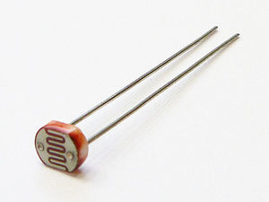
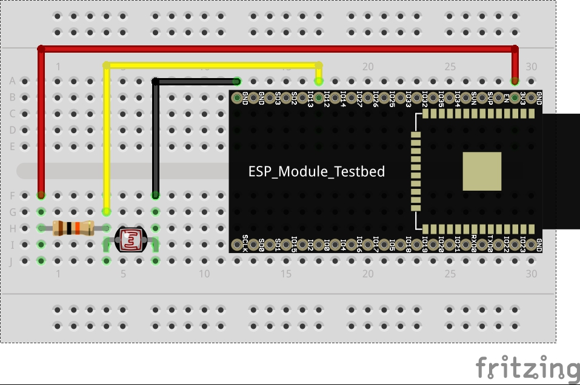

# MIシリーズ

照度センサーとして有名なのはCdsセルです。

CdSセルはフォトレジスタやフォトセルとも呼ばれ、光量によって電気抵抗が変化する素子のことです。



値の取得の方法はアナログ値で取得ができ、今回だと10kΩと一緒に使用することで取得ができます。



配線例、サンプルコードは以下のようになります。

### 配線例

下の画像の **A0 ~ A19** までのいずれかに上の画像の黄色い配線をつなげます。赤の線は **5V** 黒の線は **GND** につなげるのを忘れないように。


```cds.ino

int cdsval = 0;

void setup(){
    Serial.begin(9600);
}

void loop(){
    cdsval = analogRead(10);
    Serial.println(cdsval);
    Serial.println(cdsval/4);
    Serial.println();
    delay(1000);
}
```