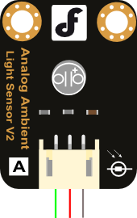

# DFR0026

このセンサーはアナログ値で照度の取れるセンサーです。

３本の線だけでアナログ値を取得できます。


## 配線

コネクタを接続して、それぞれに線をつなげていきます。



- 緑の線 ... ESP32のアナログピンに接続
- 赤の線 ... ESP32の**5V**ピンに接続
- 黒の線 ... ESP32の**GND**ピンに接続


今回はアナログピンをA0に接続したとします。

### サンプルコード

```dfr.ino
void setup()
{
  Serial.begin(9600); // open serial port, set the baud rate to 9600 bps
}
void loop()
{
      int val;
      val=analogRead(0);   //connect grayscale sensor to Analog 0
      Serial.println(val);//print the value to serial        
      delay(100);
}
```