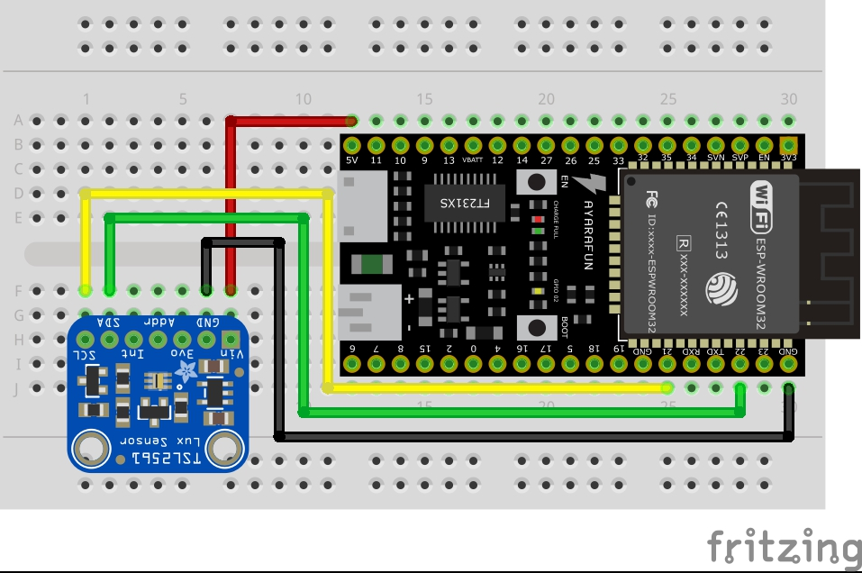

# TSL2561

これは照度を調べるセンサーですが、CdSセルのようなシンプルな光センサとは異なり、より正確に明るさを調べることができます。

可視光だけでなく赤外線光も計測できます。

公式のページは[こちら](http://trac.switch-science.com/wiki/TSL2561)

使用する際には、Adafruitが公式で出しているライブラリをインストールします。

[このページ](https://github.com/adafruit/Adafruit_TSL2561)からDownload ZIP でZIPファイルをダウンロードし、Arduino IDEにインストールしてください。

また、このライブラリだけでは動作しないので、[このページ](https://github.com/adafruit/Adafruit_Sensor)のライブラリも追加してください。

## 配線例
I2Cを使用します。

- Vin ... ESP32の **5V** に接続
- GND ... ESP32の **GND** に接続
- SDA ... ESP32の **IO21** に接続
- SCL ... ESP32の **IO22** に接続




## サンプルコード

サンプルコードはこちら

```TSL2561.ino
#include <Wire.h>
#include <Adafruit_Sensor.h>
#include <Adafruit_TSL2561_U.h>
   
Adafruit_TSL2561_Unified tsl = Adafruit_TSL2561_Unified(TSL2561_ADDR_FLOAT, 12345);

void configureSensor(void)
{
  /* You can also manually set the gain or enable auto-gain support */
  tsl.enableAutoRange(true);            /* Auto-gain ... switches automatically between 1x and 16x */
  
  /* Changing the integration time gives you better sensor resolution (402ms = 16-bit data) */
  tsl.setIntegrationTime(TSL2561_INTEGRATIONTIME_13MS);      /* fast but low resolution */

  /* Update these values depending on what you've set above! */  
  Serial.println("------------------------------------");
  Serial.print  ("Gain:         "); Serial.println("Auto");
  Serial.print  ("Timing:       "); Serial.println("13 ms");
  Serial.println("------------------------------------");
}

void setup(void) 
{
  Serial.begin(9600);
  Serial.println("Light Sensor Test"); Serial.println("");
  
  /* Initialise the sensor */
  if(!tsl.begin())
  {
    /* There was a problem detecting the ADXL345 ... check your connections */
    Serial.print("Ooops, no TSL2561 detected ... Check your wiring or I2C ADDR!");
    while(1);
  }
  
  /* Setup the sensor gain and integration time */
  configureSensor();
  
  /* We're ready to go! */
  Serial.println("");
}

void loop(void) 
{  
  /* Get a new sensor event */ 
  sensors_event_t event;
  tsl.getEvent(&event);
 
  /* Display the results (light is measured in lux) */
  if (event.light)
  {
    Serial.print(event.light); Serial.println(" lux");
  }
  else
  {
    /* If event.light = 0 lux the sensor is probably saturated
       and no reliable data could be generated! */
    Serial.println("Sensor overload");
  }
  delay(250);
}
```