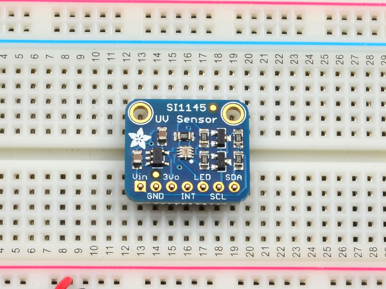

# SI1145
SI1145は赤外線や可視光の他にも、UV指数も取得することができるセンサです。UV指数とは紫外線の量に応じた指標になります。



## 実際に使う
そのままでは使用ができないので[ここ](https://github.com/adafruit/Adafruit_SI1145_Library)からzipファイルをダウンロードして、ArduinoIDEにインストールします。

今回使用するのは可視光の量だけなので、それを使えるようにプログラミングします。

#### 配線例
配線例はセンサに生えている7つのピンのうち、4本を使用します。

- Vin ... 下の画像の **5V** に接続
- GND ... 下の画像の **GND** に接続
- SCL ... 下の画像の **IO22(SCL)** に接続
- SDA ... 下の画像の **IO21(SDA)** に接続


可視光の量を受け取るためには`readVisible()`関数を使う必要があるので、それを使ってプログラムを組む


```SI1145.ino
#include <Wire.h>
#include "Adafruit_SI1145.h"

Adafruit_SI1145 uv = Adafruit_SI1145();

int rvs = 0;

void setup() {
  Serial.begin(9600);
  
  Serial.println("Adafruit SI1145 test");
  
  if (! uv.begin()) {
    Serial.println("Didn't find Si1145");
    while (1);
  }

  Serial.println("OK!");
}

void loop() {

  rvs = uv.readVisible();
  Serial.print("Vis: "); Serial.println(rvs);

  delay(1000);
}
```