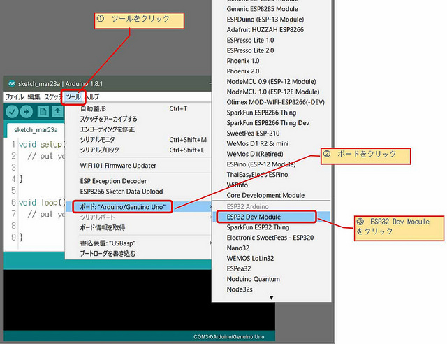

# Board setting 

実際に設定をしていきます。

まずはArduino IDEを起動します。

IDEを起動したら、メニューから

>「ツール」 → 「ボード」 → 「ESP32 Dev Module」

をクリックする。



ツールの下の方に、ボードの情報が乗っているところがあるので、少し手直しをする。

```
ボード: "ESP32 Dev Module"
Flash Mode: "QIO"
Flash Size: "4MB (32Mb)"
Partition Scheme: "初期値"
Flash Frequency: "80MHz"
Upload Speed: "115200"
Core Debug Level：　なし
シリアルポート: 自分のPCで確認する
書込み装置：　USBasp
```

このように設定をすれば使う準備がある程度整う。

(今回の画像は[mgo-tec電子工作](https://www.mgo-tec.com/arduino-core-esp32-install)さんから引用させていただきました)