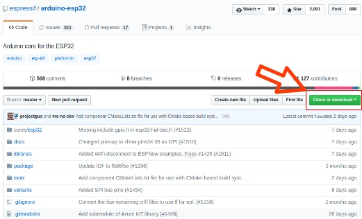
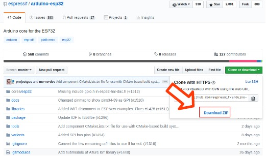

# ArduinoでESP32を開発できるようにする

Arduino IDEは他のボードも開発できるが、インストールしたまますぐでは開発はできないので設定をしていく。

使用しているOSに即した方法でダウンロードをする

[Windows](#Install(Windows))
[Mac](#Install(Mac))
[Linux(Debian, Ubuntu)](#Install(Linux-Debian))
[Linux(Fedora)](#Install(Linux-Fedora))
[Linux(openSUSE)](#install(Linux-SUSE))


# Install(Windows)
## ESP32用のフォルダを作成

### GithubからArduino core for the ESP32をダウンロード

GitHubからArduino core for the ESP32をダウンロードする。

[Arduino core for the ESP32](https://github.com/espressif/arduino-esp32)

上の方にある **Clone or Download** をクリック。



次に出てくる **Download ZIP **をクリックする。



ダウンロードが終わった後、好きなところに解凍する。解凍が終わると **arduino-esp32-master** というフォルダができる。

ここまでくればダウンロードは完了。
次はESP32用のフォルダを作成する。特に設定しなければArduinoは

`C:\Users\User-Name\Documents\Arduino`

にプログラムが保存される。ここではこの下に

``` 
hardware/espressif/esp32
```

という用に新しいフォルダを作っておく。

### esp32のフォルダに解凍したファイルをコピー

先ほど解凍したファイルを今作った`hardware/espessif/esp32`にコピーする。

次に、toolsフォルダを開き、`get.exe`を右クリックして **管理者として実行** をクリックする。

(これを忘れるときちんとインストールできない可能性があります)

これが実行されると、必要なソフトなどが自動でインストールされるので待ちます。

これが終われば次はArduinoIDEでの設定になります。

# Install(Mac)
Terminalを開き、以下のコマンドを入力していきます。

```install.sh
& mkdir -p ~/Documents/Arduino/hardware/espressif && \
& cd ~/Documents/Arduino/hardware/espressif && \
& git clone https://github.com/espressif/arduino-esp32.git esp32 && \
& cd esp32 && \
& git submodule update --init --recursive && \
& cd tools && \
& python get.py
```

プログラムが実行し終われば、設定は完了。

```
xcrun: error: invalid active developer path (/Library/Developer/CommandLineTools), missing xcrun at: /Library/Developer/CommandLineTools/usr/bin/xcrun
``` 
もし上のようなエラーが出た際は、開発ツールを`xcode-install --install`でインストールし、上記のコマンドをもう一度実行してください。


# Install(Linux-Debian)
# Install(Linux-Fedora)
# install(Linux-SUSE)

別途インストールスクリプトを用意したので[そちらをダウンロード](https://github.com/hatobus/SmartAgri/tree/ESPinit/ESPinit/script)して実行してください。


