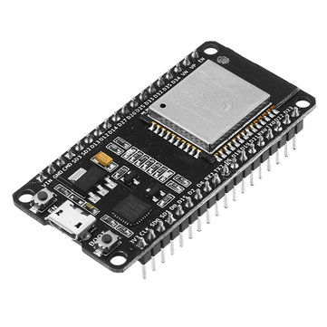
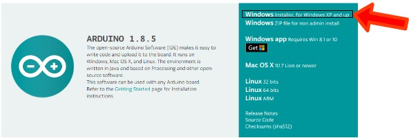
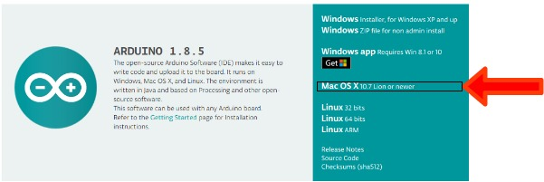
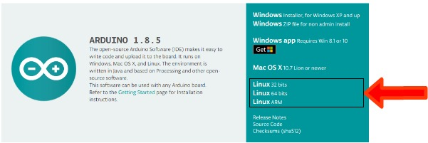

# 自分のPCにArduino IDEをインストールする

今回のスマートアグリの開発に使うのはESP32という開発用のワンチップマイコンです。

低価格でBluetooth, Wi-Fiの使用ができ、ArduinoIDE での開発ができるボードです。

これを自分のPCで使用できるようにソフトウェアをインストールしていきます。

# 1.Arduino IDE のインストール

開発をするためのソフトウェアである [Arduino IDE](https://www.arduino.cc/en/main/software) をインストールします。(クリックするとページに飛びます)

今回使用するバージョンは 1.8.5 で、お使いのPCによってダウンロードするものが違いますので注意してください。

## Windowsへのインストール
1. ダウンロードサイトの上から二番目、 **Windows ZIP file for non admin install** をクリックし、ZIPファイルをダウンロードします。
(ここで寄付を募る画面に遷移しますが、特に何もない場合は **JUST DOWNLOAD** をクリックで構いません)

2. ダウンロードしたファイルを好きな場所に展開する

3. 展開したフォルダを任意の場所に移動させる

## Macへのインストール
1. ダウンロードサイトの上から4番目の **Mac OS X 10.7 Lion newer** をクリックしてダウンロードする

2.  ダウンロードしたzipファイルを展開する

3. 展開されてできたArduinoのアイコンをアプリケーションフォルダに移動させる。

## Linux へのインストール
1. ダウンロードサイトの **Linux XXX** の、自分が使用しているLinuxのバージョンに合っているバージョンをダウンロードする。

2. ダウンロードしたものを解凍する

    例 )
    - (32bit ver)
    `tar Jxfv arduino-1.8.5-linux32.tar.xz`

    - (64bit ver)
    `tar Jxfv arduino-1.8.5-linux64.tar.xz`

3. `/opt` などの任意の位置にarduinoのフォルダを移動

    例 )
    - `sudo mv arduino-1.8.2 /opt/`

4. インストールスクリプトの実行

    例 )
    - `cd /opt/arduino-1.8.2`
    - `./install.sh`
    (うまく行かない場合は `chmod -x install.sh`などで実行を許可させる)

