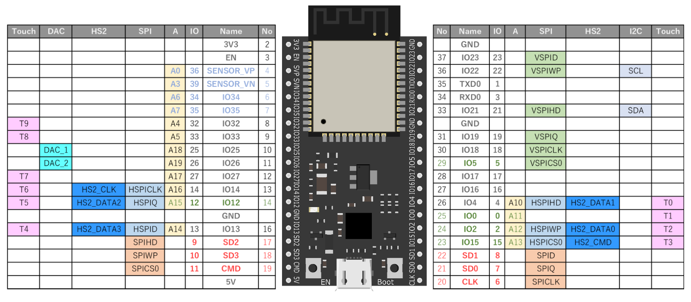

# SmartAgri

これは会津大学のOpenapplab企画である[スマートアグリ合宿2018 in 長尾農園](https://www.facebook.com/events/216671189128031/)で使用するレポジトリです。

# 今回やること
- Arduinoのインストール
- ESP32に必要なもののインストール
- 必要なものの確認
- Arduinoに触れ合う
- 実際にセンサーを使用する(Faboのドキュメントを参考に)
    - Lチカ
    - ボタン
    - 光センサ
    - 温湿度センサ
- 実際にセンサーを使用する(実際にセンサーを使用してサーバーにデータをアップロードする)

## ESP32のピン配置について

ESP32のピン配置は、必要に応じて貼っていきますが、このページにも載せておきます。

とっさにピン配置が必要になった際は、一番上のREADMEを参照することを覚えておいてください。

